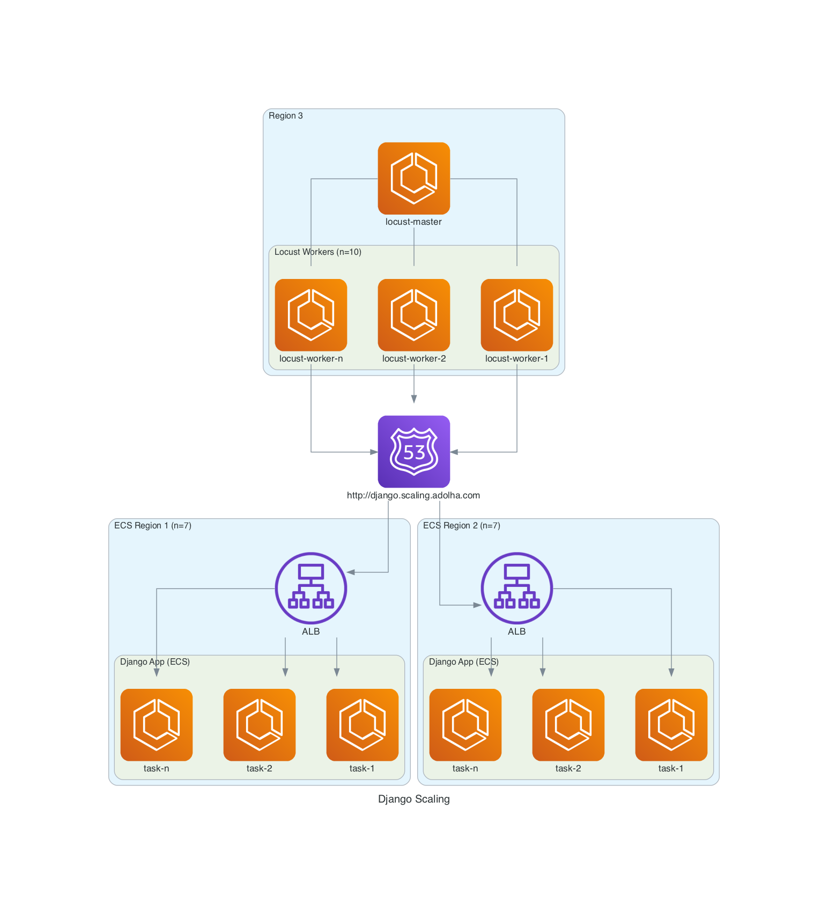

# Django Scaling
A base architecture to demonstrate that a Django app can serve 40000 rps. 

<details open>
  <summary>Architecture</summary>


</details>

The scope is to demonstrate that Django itself can serve 40000 rps, therefore 
the app itself doesn't do anything. It's not connected to any DB. It has a very 
simple view:
```
def hello(request):
    return HttpResponse("")
```
The architecture contains Route53 weighted routing between 2 ALBs in order to 
distribute load in 2 regions, since AWS has some vCPU limitations per account.
## Deployment Configuration
Django App:
* ECS task: 4 vCPU, 8GB memory
* uWSGI: 4 workers, 2 threads 

Locust is used for testing, in a distributed load configuration, with 1 master and 10 workers.
Locust master:
* ECS task: 1 vCPU, 2GB memory

Locust worker:
* ECS task: 1 vCPU, 2GB memory
* uses FastHttpUser to increase performance
* uses gevent with pool.spawn to increase performance

## Install
1. Deploy first ECS cluster for Django App.
2. Deploy second ECS clsuter for Django App.
3. Create Route53 records to enable weighted routing to the ALBs created in the first steps.
4. Deploy ECS cluster for locust tests. First, just the master service so we can obtain de master ip used by workers.
5. Deploy ECS worker service using previous master ip.
6. Run locust tests.

### ECS Cluster First Region
First, create ECR repo:
```
APP_REGION1="set first region"
aws ecr create-repository --repository-name djangoscaling --region $APP_REGION1
```
Docker login to ECR so we can push the image:
```
ECR_REPO="get ecr repo from previous command"
aws ecr get-login-password --region $APP_REGION1 | docker login --username AWS --password-stdin $ECR_REPO
```
Now, move to django-scaling folder and run the following:
```
sh deploy_aws.sh "$ECR_REPO" "v1" 
```
Deploy VPC stack:
```
APP_REGION1="set first region"
aws cloudformation create-stack --stack-name django-scaling-vpc \
    --template-body file://vpc.yml \
    --capabilities CAPABILITY_IAM \
    --region $APP_REGION1 \
    --parameters ParameterKey=Az1,ParameterValue="${APP_REGION1}a" \
    ParameterKey=Az2,ParameterValue="${APP_REGION1}b"
aws cloudformation wait stack-create-complete --stack-name django-scaling-vpc --region $APP_REGION1 
```
Deploy Django app first ECS cluster:
```
APP_REGION1="set first region"
aws cloudformation create-stack --stack-name django-scaling-ecs \
    --template-body file://ecs.yml \
    --capabilities CAPABILITY_IAM \
    --region $APP_REGION1 \
    --parameters ParameterKey=Region,ParameterValue=$APP_REGION1 \
    ParameterKey=Image,ParameterValue="$ECR_REPO:v1" \
    ParameterKey=TaskCount,ParameterValue="1"
aws cloudformation wait stack-create-complete --stack-name django-scaling-ecs --region $APP_REGION1
```
At this point, you should be able to access the URL from the stack's output LoadBalancerDNSName.

### ECS Cluster Second Region
Repeat the steps from previous section. This time use a different region.

### Route53 Weighted Routing
Add 2 records for each ALB created in previous sections. I added CNAME records pointing to the LoadBalancerDNSName 
output from django-scaling-esc stack.
### Locust Tests ECS Cluster 
First, create ECR repo:
```
TESTS_REGION="set tests region"
aws ecr create-repository --repository-name djangoscalingtests --region $TESTS_REGION
```
Docker login to ECR so we can push the image:
```
ECR_REPO="get ecr repo from previous command"
aws ecr get-login-password --region $TESTS_REGION | docker login --username AWS --password-stdin $ECR_REPO
```
Now, move to django-scaling-load-tests folder and run the following:
```
sh deploy_aws.sh "$ECR_REPO" "v1" 
```
Deploy VPC stack:
```
APP_REGION1="set first region"
aws cloudformation create-stack --stack-name django-scaling-vpc \
    --template-body file://vpc.yml \
    --capabilities CAPABILITY_IAM \
    --region $TESTS_REGION \
    --parameters ParameterKey=Az1,ParameterValue="${TESTS_REGION}a" \
    ParameterKey=Az2,ParameterValue="${TESTS_REGION}b"
aws cloudformation wait stack-create-complete --stack-name django-scaling-vpc --region $TESTS_REGION 
```
Now deploy ECS Cluster (just one master task, no worker tasks):
```
TESTS_REGION="set tests region"
ECR_REPO=""

aws cloudformation create-stack --stack-name django-scaling-ecs-tests \
    --template-body file://ecs-tests.yml \
    --capabilities CAPABILITY_IAM \
    --region $TESTS_REGION \
    --parameters ParameterKey=Region,ParameterValue="$TESTS_REGION" \
    ParameterKey=MasterTaskCount,ParameterValue="1" \
    ParameterKey=TaskCount,ParameterValue="0" \
    ParameterKey=Image,ParameterValue="$ECR_REPO:v1"
```
Get the master ip from ECS task details and deploy workers:
```
MASTER_IP="master ip"
TESTS_REGION="tests region"
ECR_REPO=""

aws cloudformation update-stack --stack-name django-scaling-ecs-tests \
    --template-body file://ecs-tests.yml \
    --capabilities CAPABILITY_IAM \
    --region $TESTS_REGION \
    --parameters ParameterKey=Region,ParameterValue="$TESTS_REGION" \
    ParameterKey=MasterTaskCount,ParameterValue="1" \
    ParameterKey=TaskCount,ParameterValue="1" \
    ParameterKey=MasterIp,ParameterValue="$MASTER_IP" \
    ParameterKey=Image,ParameterValue="$ECR_REPO:v1"
```
## Run tests
Open locust web at http://<master_ip>:8000, set the number of users, set host to http://<master_ip>:8000 and start 
running the tests.

## Shutdown

```
APP_REGION1="set first region"
APP_REGION1="set second region"
TESTS_REGION1="set first region"

aws cloudformation delete-stack --stack-name django-scaling-ecs-tests --region $TESTS_REGION
aws cloudformation delete-stack --stack-name django-scaling-vpc --region $TESTS_REGION
aws ecr delete-repository --repository-name djangoscalingtests --region $TESTS_REGION --force

aws cloudformation delete-stack --stack-name django-scaling-ecs --region $APP_REGION1
aws cloudformation delete-stack --stack-name django-scaling-vpc --region $APP_REGION1
aws ecr delete-repository --repository-name djangoscaling --region $APP_REGION1 --force

aws cloudformation delete-stack --stack-name django-scaling-ecs --region $APP_REGION2
aws cloudformation delete-stack --stack-name django-scaling-vpc --region $APP_REGION2
aws ecr delete-repository --repository-name djangoscaling --region $APP_REGION2 --force

```
